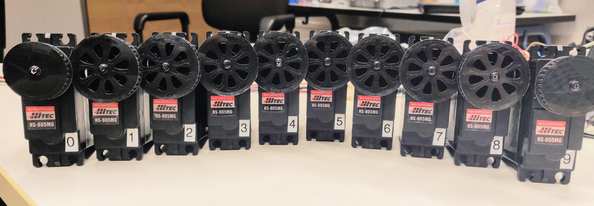

# Libsensorimotor - Python API

In this section, we describe the setup and the structure of a few experiments on position control. Our first experiments show that the robot can be used for experimenting with various control approaches and that **the motors are strong enough to make the robot stand up and perform basic motions**.

## Motorcord

The **Python API of the Libsensorimotor** library provides a possibility for **high-level control** of a series of motors equipped with the Sensorimotor boards and connected in a chain. We refer to the chain of motors connected via the RS485 bus as **Motorcord**. The IDs of the motors in the chain have to be set in sequence beginning with 0 (zero). We labeled the motors with numbers from 0 to 9 (see picture below) and have set the corresponding ID for each motor by using the set_id.py script available in the Sensorimotor repository](https://github.com/suprememachines/sensorimotor/tree/3a87a29950bdd637be39ed34af577aef0984a3cb). In the following paragraphs, we elaborate on the process of creating the motorcord and controlling the motors based on the position control approach.

<figure>
  
  <figcaption>
</figcaption>
</figure>

The following line in Python **instantiates the connection** to the robot’s chain of motors:

```python
motors = Sensorimotor (
	number_of_motors = 10,
	update_rate_Hz = 100 ,
	verbose = True )
```

The parameters <em>update_rate_Hz</em> $= 100$ and <em>verbose</em> $= True$ are default values and do not need to be set explicitly.

In order to verify that **all motors in the chain respond correctly** we can use the function ping:

```python
n = motors.ping()
```

The returned number $n$ indicates **the number of motors that did respond**. In the case of Gretchen, the expected number would be $n = 10$. 

The class <em>Sensorimotor</em> provides an internal loop which realizes the communication with the motors. In each frame of the loop, new motor commands are sent to the motors and new sensor data is retrieved. The internal loop runs as an independent thread and can be started and stopped with the following commands:

```python
motors.start()
motors.stop()
```

The function <em>get_position</em> reads out the **positions of the motors**, as measured by the position sensors:

The returned value $s$ is a list containing the positions of the motors in radiant as floating numbers. The length of the list corresponds to **the number of motors in the chain** and the position in the list corresponds to the **ID of the corresponding motor**, i.e., in the above example $s[3]$ is the angular position of the third motor. 

In our experiments, we use the **position control** as described in Section about the PID Controller. The target positions for the motors can be set with the following function:

```python
motors.set_position(p)
```

Thereby $p$ is a **list of target angular positions** for each of the motors in radiant as a floating number. The following simple example demonstrates setting the positions of all motors of the Gretchen robot to 0:

```python
p = [0.f ,0.f ,0.f ,0.f ,0.f ,0.f ,0.f ,0.f ,0.f ,0.f]
motors.set_position(p)
```

A complete basic control loop has the following form:

```python
motors = Sensorimotor ( number_of_motors =10)
motors.start()
while(True):
	s = motors.get_position()
	# do something with the positions ‘s‘ and
	# calculate new target values for the motors ‘p‘
	motors.set_position(p)
	sleep(0.01)
motors.stop()
```

The above loop is executed **independently of the internal communication loop**. The functions <em>get_position</em> and <em>set_position</em> are non-blocking, which makes it necessary to **artificially pause the control loop** with the $sleep(0.001)$ function, in order to wait for the internal loop to finish execution. This makes the control-loop robust since the
internal communication is not interrupted in case the calculations in the main loop take longer than permitted by the frame rate (in our case 10ms). In the future, the API should be extended with functionality which would also allow synchronizing the main loop with the internal communication loop, in order to ensure precise control of the motors’ positions.


