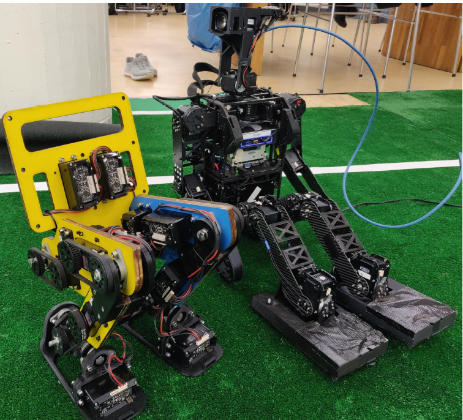
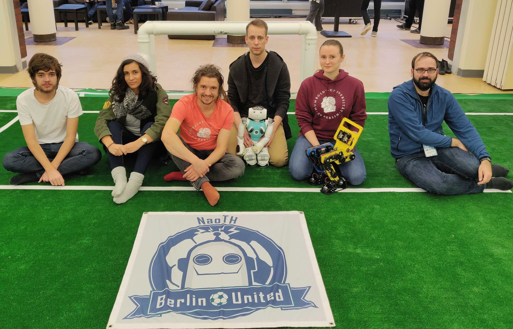
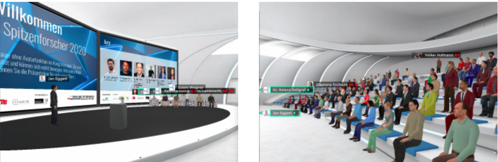

# Conferences 

One of the future goals of the Gretchen robot is joining the Humanoid League of RoboCup and driving collaboration with the other teams who have extensive experience in designing and manufacturing humanoid robots. The Gretchen robot has already
been demonstrated at two events organized by the **RoboCup community**. 

## RoHOW

The first public appearance of the Gretchen robot was at the [Robotic Hamburg Open Workshop (RoHOW)](https://rohow.de/2019/en/), to which we traveled with the **Berlin United Team** from the Humboldt University. The **RoHOW** is an educational and networking event of the Hamburg University of Technology (TUHH) with students and scientists from all over the world that are active in research on humanoid robots. The researchers and students from other teams showed great interest in the Gretchen robot, especially in its actuators powered by the Sensorimotor boards. In the left photo below, the Gretchen robot is sitting next to the Hambot robot from the Bit-Bots team from the University of Hamburg, which was the only team from the Humanoid League of RoboCup at the RoHOW. 

<figure>
  
  <figcaption>
</figcaption>
</figure>

We exchanged experience with each other and discussed collaboration ideas and the potential of the Gretchen robot for joining the Humanoid League of RoboCup. The photo below shows the members of the Berlin United Team from the Humboldt University who attended the RoHOW, with the Nao and Gretchen robots sitting on the laps of two team members.

<figure>
  
  <figcaption>
    The NaoTH Team at Rohow, where the Gretchen robot was introduced to the RoboCup community for the first time.
</figcaption>
</figure>

## V-RoHOW

We have also presented the Gretchen robot in a **60-minute talk** at the [Virtual RoboCup Humanoid Open Workshops (V-RoHOW)](https://humanoid.robocup.org/virtual-rohow-2020/program/), together with Heinrich Mellmann and Matthias Kubisch. **V-RoHOW** is an online workspace for the **RoboCup Humanoid community** to get together, pitch ideas and socialize. This online event was organized for the first time, due to the cancellation of RoboCup 2020. Our presentation was called **’Gretchen - a Humanoid Open Hardware Platform for Education and Research’**, where we presented the current state of the Gretchen project, some of the robot’s most interesting hardware features, the software architecture, and the Sensorimotor
boards. In the 15-minute discussion after our talk, questions about the Sensorimotor boards were asked and discussed, namely about the board microcontroller, serial bus and its cables, and the features of the boards. The talk was recorded and published on [YouTube](https://www.youtube.com/watch?v=tsjLt30-Pxw&t=2495s).

   <iframe width="950" height="534" src="https://www.youtube.com/embed/tsjLt30-Pxw" title="YouTube video player" frameborder="0" allow="accelerometer; autoplay; clipboard-write; encrypted-media; gyroscope; picture-in-picture" allowfullscreen></iframe>
 

## Forum Junge Spitzenforscher

Once a year, the Foundation for Industrial Research and the Berlin universities look for young scientists with original and practical ideas and solutions that have emerged from their innovative basic research as part of the science competition “Forum Junge Spitzenforscher”. On November 18, 2020, the virtual closing event (see pictures below) and awarding of the winners took place in cooperation with Humboldt Innovation. The project "Volksbot: Gretchen" got into the final round and won a prize.

<figure>
  
  <figcaption>
</figcaption>
</figure>

