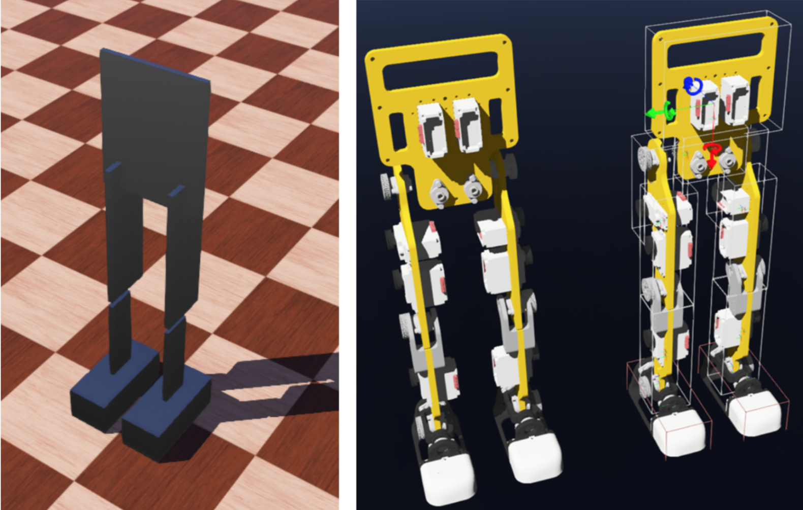
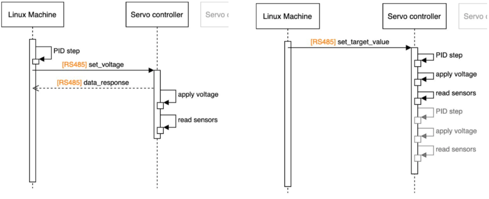
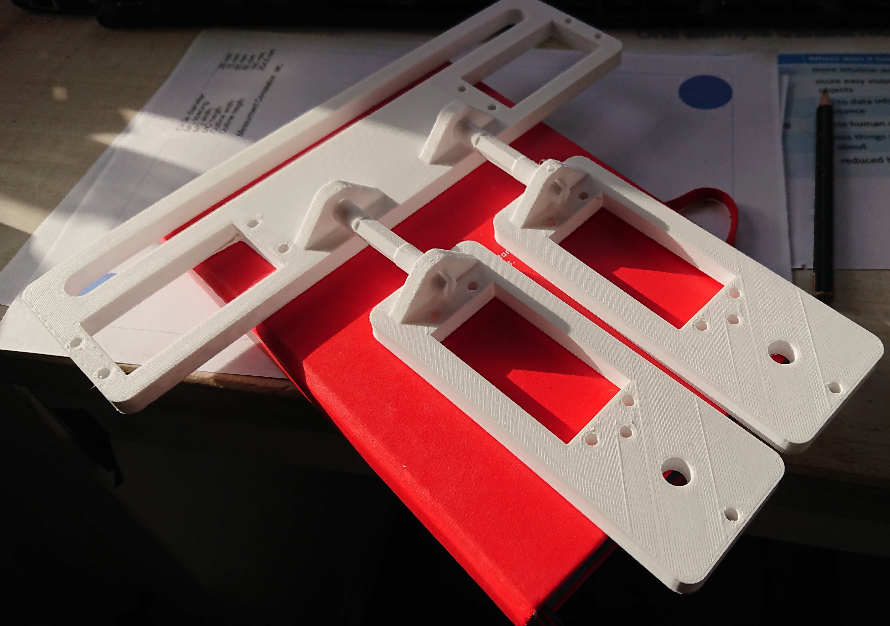
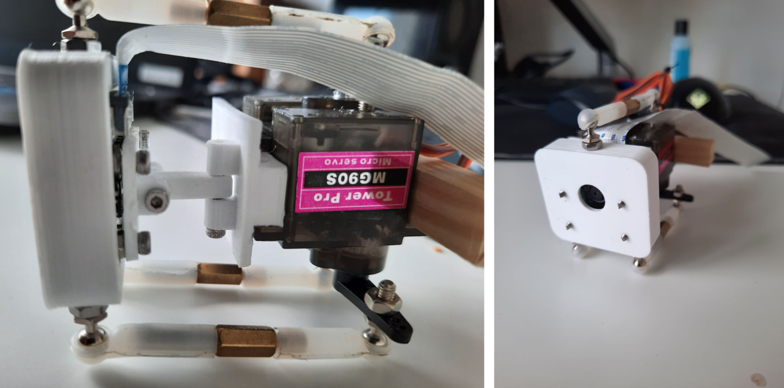
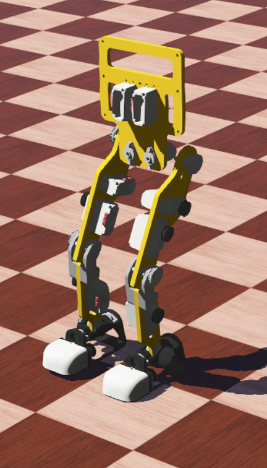

# University Projects

## Proseminar Humanoid Robots (SoSe20)
In this [Repository](https://scm.cms.hu-berlin.de/adapt/teaching/ss20-shr/5-gretchen/-/tree/master) all contributions, code and the final paper can be found. 

### Simulation in Webots

 Any humanoid robot can benefit from having a corresponding 3D-model simulation, which can be used for testing new software and experimenting with various behaviors and motions, with no hardware exploitation. The simulation software would also enable the use of the robot in educational projects for bigger groups of students, where there’s no possibility of providing each person with a robot. 

 During the proseminar, a 3D-model of the Gretchen robot was created inside the **Webots** simulation environment. The students  used the CAD data in .f3d format of the individual components available in the Gretchen Git to determine the exact dimensions and then transfer them to the Webots model. They have also programmed short scripts in order to test the proper funtionality of the 3D-model, namely the motor control, all degrees of freedom and the fuctionality of the bounding boxes as a limitation for interaction between body parts.

<figure>
  
  <figcaption>
</figcaption>
</figure>

### Extended firmware

One of the limitations of the robot was that the controllers were implemented in the Libsensorimotor module and were therefore executed on an external computer. This introduces a significant delay in the control loop because at each time
step the motors send commands with their current state to the computer and wait for it to recalculate the data and send the new commands back (as shown in the left figure below). One possible solution that doesn’t involve any additional hardware is running the PID controller directly on the ATmega238P microcontroller. The firmware of the robot is completely customizable and the embedded microcontroller of each motor delivers enough performance to perform more complex calculations. Therefore, the RS-485 bus control could be handled directly by the firmware, if the controller software runs directly on them. The seminar participants extended the firmware of the Sensorimotor board with the PID controller, as ilustrated in the right figure below. 

<figure>
  
  <figcaption>
  	Left sequence diagram: PID controller running on a Linux machine. Right sequence diagram: PID controller running on firmare.
</figcaption>
</figure>

## Semester Project Humanoid Robots (WiSe20)

During the winter semester 20/21 four groups of students were working on different projects linked with the Gretchen project as a part of the Semester Project "Humanoid Robots". Below are listed the achieved results and builds. In this [Repository](https://scm.cms.hu-berlin.de/adapt/teaching/ws20-sphr) all contributions, code and the final paper can be found. 

### A new hip joint design with 3 DOFs

 In the current hardware configuration of the Gretchen robot, the hip joint lacks one degree of freedom - the yaw, meaning that the robot can only walk forward and backward and cannot turn around its rotational axis. A group of student tried to make a new design of the hip joint with 3 DOFs and 3D-printed the first prototype, shown in the picture below.

 <figure>
  
  <figcaption>
</figcaption>
</figure>

### PID controller running on firmware

### 3D-printed eye for visual processing

 <figure>
  
  <figcaption>
</figcaption>
</figure>

### Improved Webots simulation

  <figure>
  
  <figcaption>
</figcaption>
</figure>

