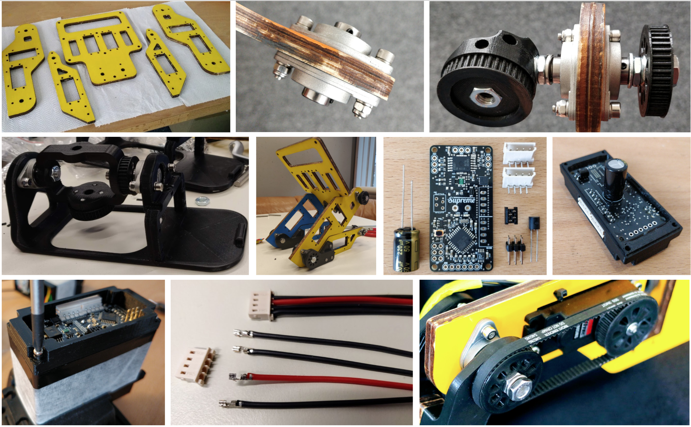

# Hardware Introduction

The building process of the Gretchen robot can be divided into 3 stages which
require different levels of expertise. The first stage includes purchasing all commercially
available electronic, wooden, and drive components and ordering the custom boards. The
second stage involves manufacturing the body parts by using special equipment such as
a laser cutting or milling machine and a 3D-printer. The final stage includes gluing and
coloring the wooden parts, soldering the electronic components to the custom boards,
assembling the motors, manufacturing the cables, and putting everything together.

<figure>
  
  <figcaption>
  	An overview of the assembly stages and of the major hardware components.
</figcaption>
</figure>

