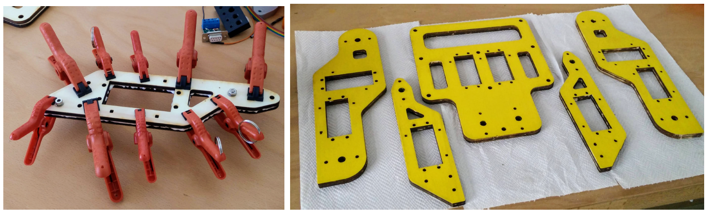

# Wooden Parts
The robot’s body incorporates feet, shanks, thighs and lower torso, which are shown on
the right side of Figure 3.1. Gretchen’s legs and lower torso are made of plywood, which
is a versatile and low-cost building material made from thin layers of wood veneer glued
together [48]. The way plywood is made ensures consistent strength across the entire
length of the wood, which makes it resistant to warping, cracking and twisting

<figure>
  
  <figcaption>
Left picture: The process of gluing 2 plywood plates together and using small
clamps to apply appropriate pressure distributed on the full surface. Right picture: The
wooden body parts drying on paper towels, after being painted with yellow color and covered
with clear coating.
</figcaption>
</figure>

Plywood is the optimal choice of material for Gretchen’s limbs because 3D-printing
parts of this size is time-consuming and they wouldn’t fit into a conventional 3D-printer.

The assembly documentation states that there are 10 wooden pieces, which need to be
glued together pairwise, in order to achieve the needed thickness of 1cm. The reason
for this is that the laser cutting machine used for carving the wooden parts, was able
to cut through 5mm thick wood surfaces. One can use 1cm wide plywood plates when
having access to a more powerful laser cutting or milling machine. The left photo in
Figure 3.1 illustrates two wooden plates glued together using small clamps to apply
uniform pressure on the full surface.

Each side of the wooden body parts is painted with a different color and covered with
a few layers of clear coating for protection against humidity and fat. Having the back
and the front of the robot painted in different colors is not a compulsory step, but it
may ease the assembling process and make the robot more appealing. All wooden parts
have either one or two rectangular holes for the servomotors, a few round holes for the
cable ties and the bearings. The lower torso has 3 additional rectangular holes, which
are designed for grabbing and lifting the robot.
