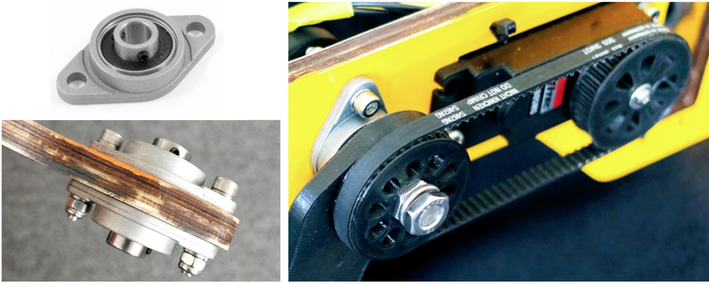
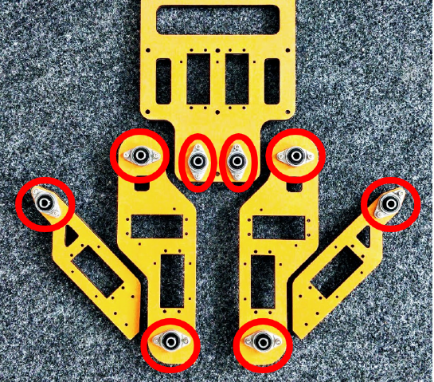
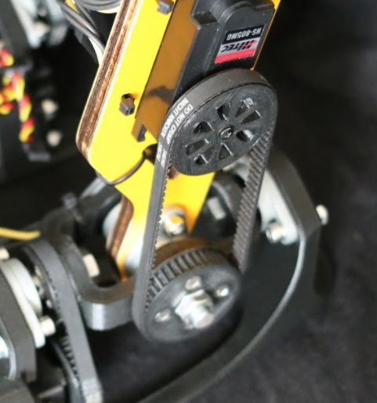

# Drive Parts
Drive parts include all moving components which ensure that the body parts and
the joints of the robot are able to move or rotate. In this section, we describe the
main drive components used for Gretchen: bearings and toothed belts. The assembly
documentation only provides information about how to install them. Below we offer a
more detailed overview of each drive component.

<figure>
  
  <figcaption>
  	On the left side: Bearings mounted on the wooden parts. On the right side: A toothed belt connecting a joint and an actuator.
</figcaption>
</figure>

## Bearings
The bearings ensure a smooth connection between the joints and the body plates, due
to tiny steel balls inside, which allow the parts to roll around each other with reduced friction. The assembly kit contains 20 KFL08 bearings, with the inside diameter of 8mm and two mounting holes. The bearings should be connected in pairs on each side of the wooden plates, as well as on the 3D-printed feet frames. It’s important to place spring washers between the wood and the steel components, in order to protect the surface from damage, distribute the pressure, and prevent the bolts and nuts from moving or corroding.

<figure>
  
  <figcaption>
Bearings mounted on the wooden parts, marked with the red circles.
</figcaption>
</figure>

## Toothed Belts

Toothed belts are flexible bands with teeth carved onto their inner surface, designed
to run over matching toothed pulleys. These belts ensure an indirect transmission
between the joints and the motors, thereby making the connection between them more
elastic and protecting the motors from the direct damage of heavy loads. However, this mechanism has a few disadvantages, such as lack of precision due to the mechanical freedom at the connecting points between the joints and the motors; as well as power loss, due to the motion devices between the motor and the joint which need to be moved. The indirect drive mechanism is rarely used in humanoid robotics and therefore represents an interesting research direction, as its elasticity allows more naturally looking movements of the robot.

<figure>
  
</figure>

The 3D-printed pulleys of the motors and the joints are connected pairwise via 10 GT3
6mm wide toothed belts, eight of which have the pitch length of 303mm and the other
two - 174mm. The position of the timing belts is very important because they define the movement ratio of the servos. Therefore, Matthias Kubisch recorded a helpful video where the installation of the toothed belts is demonstrated:

  <iframe width="950" height="534" src="https://www.youtube.com/embed/zkVwW5wzHFk" title="YouTube video player" frameborder="0" allow="accelerometer; autoplay; clipboard-write; encrypted-media; gyroscope; picture-in-picture" allowfullscreen></iframe>
 

