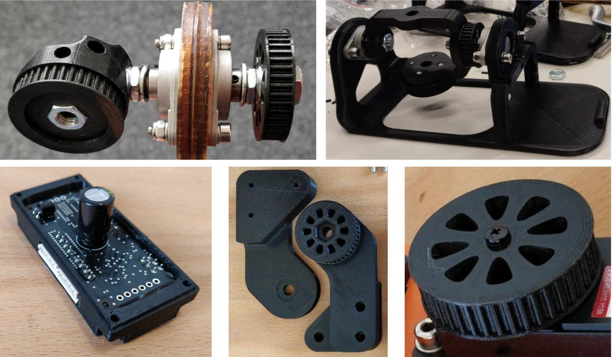
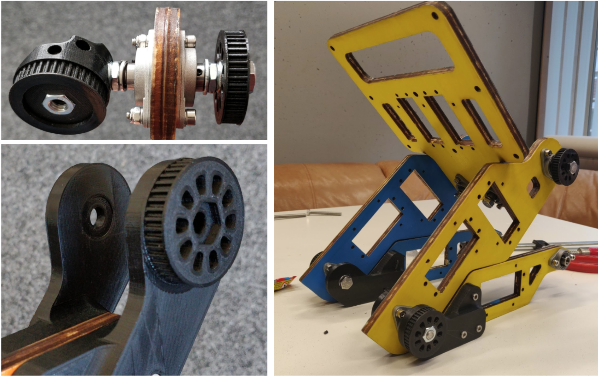
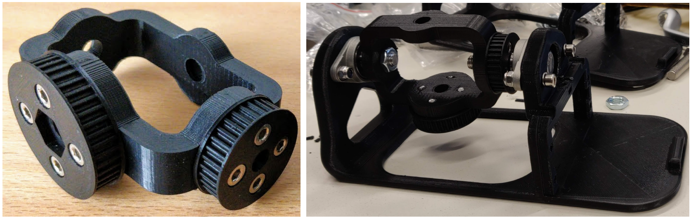
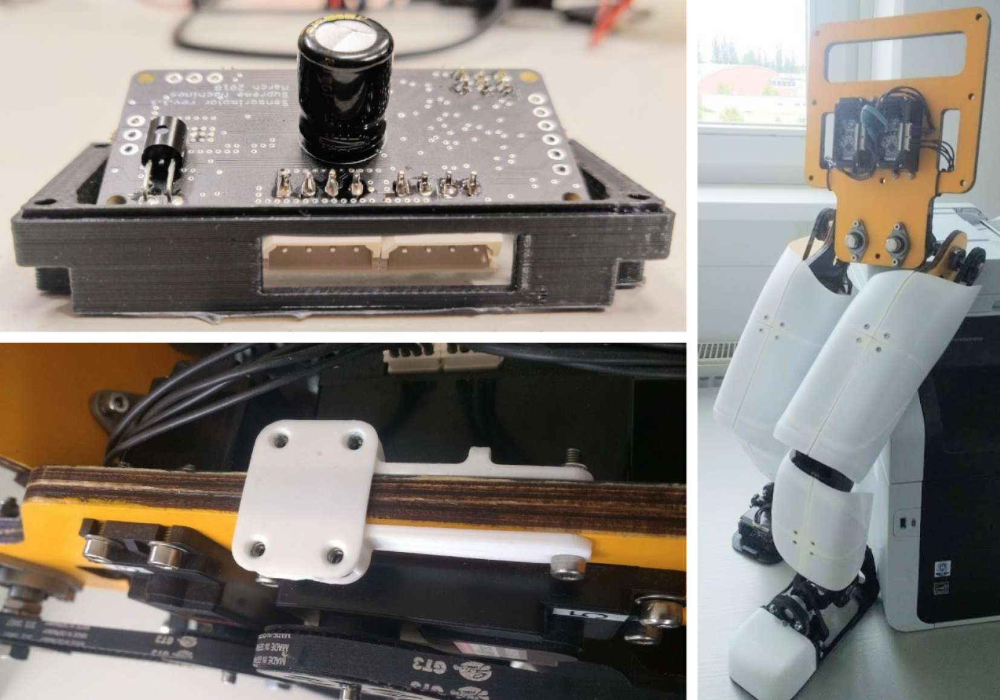

# 3D-printed Parts

In this section, we briefly introduce the 3D-printing technique of manufacturing objects
and describe the 3D-printed components, namely: pulleys, joints, feet, motor covers
and shells. 3D-printing is a low-cost manufacturing process of objects, by applying thin layers of a
material, also called filament, onto one another. All open hardware robots come
with CAD files containing the 3D models of different components, which can be either
3D-printed or reproduced through other manufacturing techniques. The 3D-printed
parts for Gretchen were manufactured in an Ultimaker printer by using ABS plastic
and tough PLA filament.

<figure>
  
  <figcaption>
  	The overview of the major 3D-printed components (from left to right): hip joint, ankle joint and foot, motor cover, knee joint, and pulley. 
</figcaption>
</figure>

## Pulleys

The joints of the robot have pulleys on the outer sides, which are coupled with the servo
pulleys with toothed belts. Pulleys are wheels, designed to support the movement and
change the direction of the belts along their circumference. The assembly kit contains
pulleys that either differ in size or in the shape of the hole in the center. The D-spline
motor pulleys from the assembly documentation, 10 in total, refer to the ones which have to be installed on the servo shaft instead of the horns (they are a default part of
the servo set). The remaining four pulleys are used for the gimbal joint, which will be
discussed in the following section. The terms 42T and 33T following the name of the
pulleys, represent the number of teeth, carved into the surface of the pulleys.

<figure>
  
  <figcaption>
  	Top left: The hip joint. Bottom left: The knee joint. Right picture: Wooden body parts after connecting the wooden plates with the joints.
</figcaption>
</figure>

## Joints

Each knee and hip joint consists of two 3D-printed parts, namely the inner and the
outer one, which are shown in Figure 3.4. The knee components are symmetrical, the
only difference being the integrated pulley on the outer side of the knee. Both parts
should be connected through the shank bearing. It’s important to use a moderate
amount of power when screwing the nuts, in order to prevent the screw from damaging
the plastic. The knee of the robot has only one degree of freedom - the pitch.

The hip mechanism consists of a flat pulley on the outer side and an X/Y integrated
pulley on the inner side. Before mounting the hips, one should check whether the hex
nuts fit inside the pulleys. Depending on the tolerance of the 3D printer, the pocket of
the pulley might be a bit loose, which can be solved by using superglue for fixing the
nut. In case the pocket is a bit tight, one should use a clamp for adding a little force when inserting the nut inside it. Once the flat hex nut pulleys are done, the bolt must
be inserted from the nut side first, in order to ensure continuous threading between
the nut and the plastic surface. Before inserting the bolt through the other side, the
remaining plastic or sharp edges should be removed, for instance, by using a paper
cutter. A 15mm deep hole should be made in the pulley on the inner side of the hip,
prior to connecting both pulleys through the hip bearings. This step should not be
skipped, as, without it, the bolt would get stuck halfway through the assembly process
of the hip joint. When connecting the hip components, a normal washer must be used
at the outer side and the spring washer at the inner side.

The ankle joint incorporates three 3D-printed components, namely, a 33 teeth pulley, a
42 teeth pulley, and a cardan gimbal frame. Both pulleys should be attached to the
cardan joint, as shown in the picture below. The small pulley ensures the roll
movement of the joint and the bigger one - the pitch movement.

<figure>
  
  <figcaption>
  	The first picture illustrates the ankle joint. In the left picture: the foot with the gimbal joint attached.
</figcaption>
</figure>

## Feet

The feet of the robot are two perfectly identical 3D-printed parts. Before mounting
the ankle joint on the foot frame, the toothed belt with the pitch length of 174mm
should be inserted around the ankle. Note that in the right picture above,
the toothed belt is missing, meaning that we had to unmount the ankle joint, put the
belt around it and mount it again. Gretchen’s feet are different from the majority of
the other humanoid robots, as they carry one servo motor each. These servos enable
the roll movement of each foot, however, they add extra weight to the feet and may,
therefore, make walking more challenging and less energy-efficient.

## Motor Covers

Since the new boards occupy more space than the old ones, due to the additional
electronic components, the old motor cover cannot be used for closing the motor box. The assembly kit contains ten 3D-printed motor covers, which should hold the custom
boards and attach them to the motor housing. As shown on the top left part of figure below, the side opening, designed for the bus connectors, may be slightly shifted (in this
example to the right). This shift can result from the error of the 3D-printer. Therefore,
in order to insert the board inside the cover, the side opening should be enlarged. We
used a drill to make these holes a few mm wider.

## Shells

Our assembly kit didn’t include the shells, however, they represent a useful hardware
component and are therefore worth mentioning. The 3D-printed shells were designed for
protecting the electronic components and the belt system from collisions and damage.
In the right picture of the figure below the Gretchen robot is shown, with the shells protecting
its thighs, shanks and feet. The shells are mounted on 3D-printed adapters, which are attached to the wooden parts, as shown in the lower-left picture of figure below. The
adapters allow a quick assembly and removal of the shells. Although the limbs of the
robot weren’t designed with attachment points for the shells, they have holes for cable
management zip-ties, which can also be used for attaching the shell adapters. The
shells for the thighs and the shanks consist of multiple 3D-printed pieces, and therefore
can be printed by using a conventional 3D-printer.

<figure>
  
  <figcaption>
  	Top left picture: The Sensorimotor board situated halfway inside the 3D-printed
motor cover. The side hole is slightly shifted to the right and the board doesn’t fit inside
the motor cover. Bottom left picture: A permanently attached adapter to the wooden part
enables a quick assembly and removal of the shells. Right picture: The shells are protecting
the thighs, shanks and feet of the robot.
</figcaption>
</figure>

