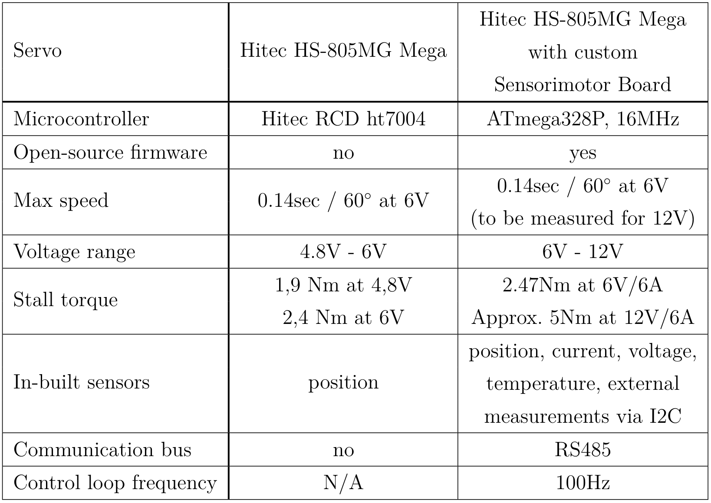
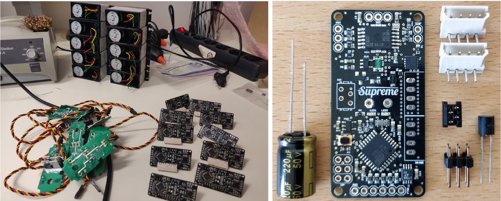
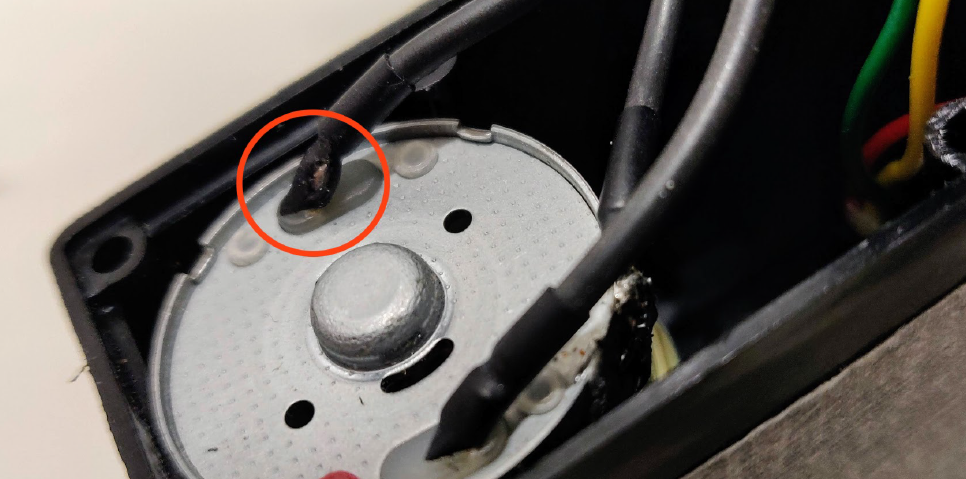
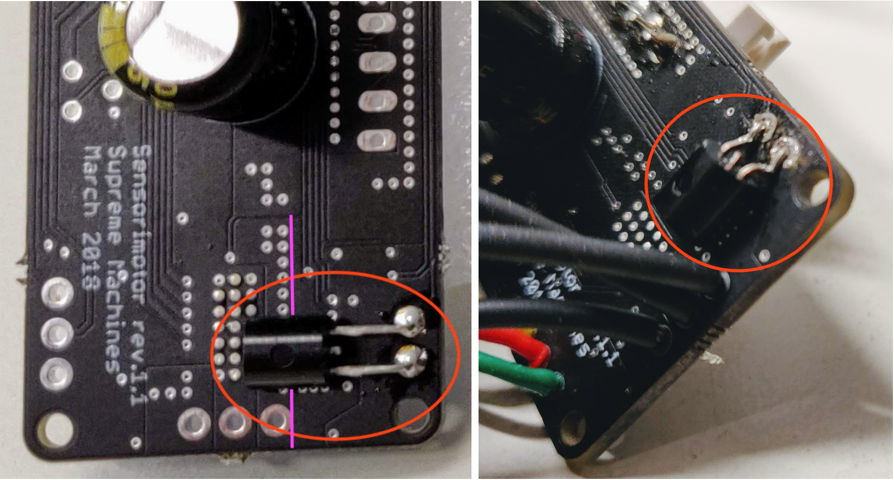
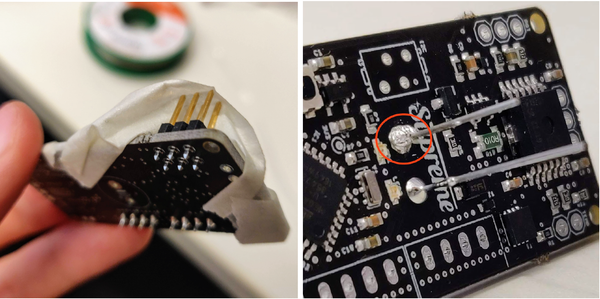

# Servos and electronic components

The Gretchen robot is powered by **10 low-cost Hitec HS-805MG Mega servo motors**, the distinguishing features of which are the **custom Sensorimotor boards**. These boards were designed by the creators of Gretchen, aiming to add more features, namely, **more torque, sensory data, bus communication and customizable firmware** to simple and low-cost servo motors, thereby drastically lowering the overall price of the robot. The servos are placed either above or below the robot’s joints and are connected to them with toothed belts.

The actuators are communicating with each other via the **RS485 serial bus** and with the computer - via a **USB-to-Serial adapter**. The available C++ libraries can be compiled on a Linux machine and the robot can be further developed through a Python API. The motion of the robot can be programmed using both **position and torque control**. The Libsensorimotor library offers an implementation of a PID controller, which is a position control mechanism.

## Servo

For powering Gretchen the **HS-805MG Mega Giant Scale, Metal Gear analog Servo** is used. It belongs to the largest category of Hitec servos, with a heavy-duty metal gear train, a strong 10mm, 15 tooth output shaft which generates 2,4Nm of torque and a 3 pole brushed motor. This servo cannot be used for powering a robot just as it is, because of a few disadvantages. First, it cannot be easily connected to other servos in order to create a communication bus. Second, its on-board Hitec RCD ht7004 microcontroller is custom made and cannot be easily programmed, because there’s no datasheet available online. These challenges can be undoubtedly solved with another servo motor, with publicly available microcontroller information, a more complex integrated circuit and bus connectors, but for a much higher price. The creators of Gretchen overcame these challenges by designing a custom board with an easily programmable on-board microcontroller, bus connectors and many more useful features that are displayed in the table below and will be discussed in the next subsection.

<figure>
  
  <figcaption>
</figcaption>
</figure>

## Sensorimotor Boards

As mentioned in the previous paragraph, the analog servo from the assembly kit has a few disadvantages and the custom boards and the electronic components from the assembly kit are a low-cost solution for overcoming them. The **Sensorimotor boards** have an **ATmega328P 16MHz microcontroller**, an **ISP connector** for programming it, two **RS485 Bus connectors**, an **I2C bus connector**, and a **temperature sensor**. The integrated circuit of the new board can handle a voltage up to **12V**, which is twice as much as on the old board, thereby doubling the torque of the motor to **5Nm**. This board can be used with other servos of similar size and features, with the maximum voltage limit of 12V. Before inserting the new board inside the servo, the old one has to be carefully removed, by desoldering the ground and the motor pins with a soldering iron and a desoldering pump. We used a 50W soldering station which can heat up to 450&deg;C. We used a 1mm thick lead-free soldering wire with 99,3% tin and 0,7% copper. The grounding pin is sinking much heat and even after setting the maximum temperature, it was still very hard to desolder it, so we lifted most of the boards together with the ground pin and the glue with which it was fixed to the motor. In this case, the process of soldering a cable to the motor was more challenging, than when the grounding pin remained on the motor. We’ll elaborate on solving this problem in the Cables and Wires Section. After removing the old board, the following components have to be soldered to the new one: a **temperature sensor** and a **capacitor** on the backside and an **I2C connector**, an **ISP 6-pin header**, and two rectangular **4-pin motorcord sockets** on the front side of the board. The new board and the mentioned electronic components can be seen in the left picture below.

<figure>
  
  <figcaption>
</figcaption>
</figure>

### Temerature Sensor

The **temperature sensor** is placed on the backside of the board behind the microprocessor, in order to measure its temperature and eventually, prevent it from overheating. The KTY 81-110 silicon temperature sensor has a positive temperature coefficient (PTC), meaning that its electrical resistance increases with the temperature. This sensor is very stable and can measure the temperature in the range between -55&deg;C and +150&deg;C with a negligible drift over 50 years.The KTY 81-110 temperature sensor has 2 pins: GND (Ground) and ADC (Analog to Digital Converter). The ADC pin transforms the analog voltage input into the digital one, where a voltage change of 7.59 mV corresponds to a change of 1&deg;C. **The position of the temperature sensor is very important**, because when closing the motor box, it will be tightly packed between the motor’s ’hill’ and one of the motor pins. The left picture below illustrates the damaged insulation of the motor wire positioned under the temperature sensor, which resulted after closing the servo cover.

<figure>
  
  <figcaption>
  	Damaged motor wire after closing the servo cover.
</figcaption>
</figure>

This damage can potentially generate a short circuit and break the motor. In order to prevent this from happening, the feet of the temperature sensor should be bent 3 times by 90 degrees in a staircase shape, as shown in the second picture below. The body of the sensor should be placed below the H-bridge with the flat side faced to the board surface. The left picture below is an example of an incorrect positioning of the temperature sensor, since it exceeds the purple line.

<figure>
  
  <figcaption>
</figcaption>
</figure>

### ISP header 

The **6-pin ISP header** is used for flashing the firmware on the microcontroller, this process being called **In-System-Programming (ISP)**. The 6 pins of the ISP header correspond to the following lines: Master In – Slave Out (MISO), Serial Clock (SCK), Reset, Power, Master Out – Slave In (MOSI) and Ground. While soldering the ISP header, the pins shouldn’t be heated for too long, as they heat up very fast and can change their position. We fixed the ISP header with tape, as shown in the left picture below. The tape stabilized the pins and prevented them from changing their position during the soldering process.

<figure>
  
  <figcaption>
</figcaption>
</figure>

### Electrolytic capacitor

The **220μF electrolytic capacitor** is a polarized component that stores electricity and then discharges it into the circuit in case of an electricity drop. It has two pins of different lengths: the anode (the longer one) which receives voltage and the cathode (the shorter one) which sinks it to the ground. When soldering the capacitor, the
cathode (ground lead) will sink a lot of heat, because it is directly connected to a large ground plane of the Sensorimotor board. We solved this issue by applying soldering fat around this pin, setting the maximum temperature on the soldering station and heating the area around the pin for a longer time. Due to the longer heating process, the ground pin of the capacitor has more flux than the other pin, as shown in the right picture above.

### RS485 bus sockets

The rectangular **4-pin RS485 bus sockets** are used for connecting the servos in a chain with the serial cables. Before soldering the bus sockets, it is important to push them tightly into the board surface, in order to ensure a stable connection after putting cables in and out multiple times. Each RS485 socket consists of 4 pins: GND, VCC, A and B. We elaborate on the functionality and its features in the Software Section about the RS-485 Bus.

### I2C connector

The **I2C connector** can be used for connecting external sensors to the robot, such as the MPU6050 accelerometer and gyroscope sensor. The I2C (pronounced I-squared-C) serial protocol allows low-speed devices like microcontrollers and similar embedded systems to communicate with each other via a two-wire interface: SCL (clock line) and SDA (data line) [56]. It allows both multiple masters and slaves, and in our case, the AVR microcontroller acts as the master, meaning that it generates the clock and initiates the communication with the slave (e.g. MPU6050), which receives the clock and sends a response back. The master supplies the slave with voltage through the 3V3 pin and sinks it with the GND pin to the ground plane.

