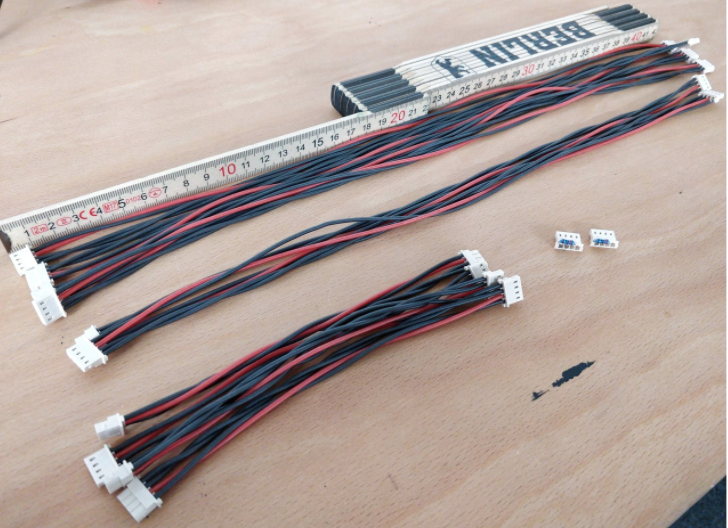

# Cables and Wires

Self-made cables are another important component that keeps the overall costs of the robot lower. In this section, we first elaborate on the wires connecting the servo motor to the Sensorimotor board (**motor and potentiometer wires**) and then the cables connecting the servos between each other (**RS485 bus cables**).

## Motor and Potentiometer Wires

Each servo should have **three 5cm wires** connecting the ground and the motor pins to the board. A stripping tool is required for removing around 4mm of insulation from both ends of all wires. The wires’ ends should be **twisted and pre-soldered**, in order to hold the wires together and ensure a good electrical connection.

**If the ground pin was removed** when desoldering the old servo board, then the remaining glue on the motor should be first removed. We used sandpaper to make the motor’s surface smooth. Then we applied zinc chloride on the area where the ground pin would be soldered. Zinc chloride is a corrosive substance used for the pre-fluxing of metals prior to soldering. 

We soldered the ground cable to the motor by using a **gas torch**, which can heat its tip up to 550C. After soldering the cables to the motor, we cut diagonally **5mm long pieces of sleeving**, in order to **cover the ground and the motor pins**. We used the open flame option of the gas torch for shrinking the sleeving tubes and isolating the motor pins. This is **an important step** because the cables will be packed tightly near each other after closing the motor box and **open contacts may therefore generate a short circuit**.

The **copper potentiometer cables are not as heat resistant as the silicone ones**, because copper and silicon wire insulation break down if the temperature exceeds 100&deg;C and 250&deg;C respectively. Therefore, while pre-soldering them, the **insulation might start melting**. In order to avoid this, we dipped the twisted wires’ ends into **soldering fat**, therefore significantly speeding up the pre-soldering process.

## RS485 Bus Cables

The connection between the servos is ensured by the **RS485 bus**, which consists of cables with 4 wires each: ground, power, data lines A and B. The distance between the motors is different, therefore cables of the following lengths are required: 42cm (4 cables), 38cm (2 cables) and 16cm (3 cables). 

<figure>
  
  <figcaption>
</figcaption>
</figure>

Custom made cables have two major advantages: **low manufacturing costs and the exact necessary length**. Nevertheless, self-manufacturing may be time-consuming if a crimping tool is not available and if not handled with care, the connectivity of the cable might be reduced due to insulation damage. Using cables of different colors is not compulsory, but it may ease the manufacturing process as well as denote a personalized style. Therefore the black silicone cables are used for denoting the ground and the data lines and the red cable is used for the voltage carrying line. The cables should be **twisted pairwise** 4 to 6 times, in order **to reduce the electromagnetic noise**. Connecting the actuators with the RS485 cables represents the last step of the hardware assembly. Finally, we tied the cables close to the wooden parts using zip-ties. 

