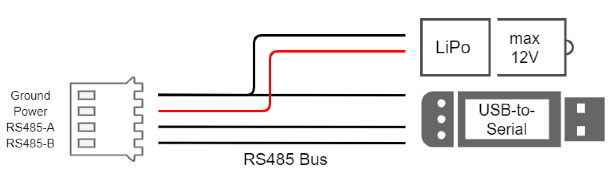

# Power Supply

After finishing soldering the boards and connecting them with the motor and potentiometer wires to the servo motors, it can be beneficial to check if nothing is broken at this point. We **checked the boards for short circuits with a multimeter** before closing the lid and plugging a power supply into the servo for the first time. As mentioned in
the previous paragraphs, the cables are **packed very tightly in the motor’s housing** and there’s a probability that the **wire’s insulation gets damaged** when pressing the board inside the motor, which might result in a short circuit and a broken motor. Therefore, we **checked the boards for short circuits both before and after closing the servo lid**, in order to make debugging easier in case a problem would have been detected.

When connecting to the RS485 bus, it is necessary to use **an external DC source of power**, which can produce a constant output voltage. **A single servo can draw up to 6000mA** and the **input voltage range is from 5V up to 12.6V**. The HS-805MG servos can properly function with an input voltage of 6V, but due to the new electronic components, it can be powered with doubled power and therefore deliver twice as much torque. Therefore, for the best performance of the servo motors, it is recommended to either use a **12V power adapter** plugged to a power socket or a **lithium polymer (LiPo) battery with 3 cells**. Each cell of a LiPo battery has a nominal voltage of 3.7V so a battery with 3 cells will deliver around 11,1V. We manufactured a Y-shaped adapter for connecting the serial bus to a computer via a USB-to-Serial device and a power supply, as shown in the figure below.

<figure>
  
  <figcaption>
</figcaption>
</figure>
