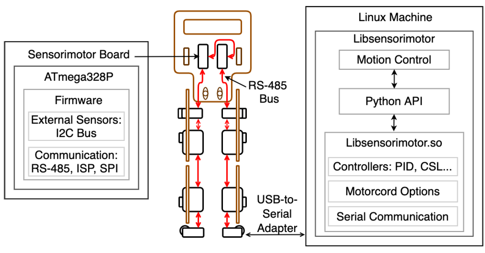

# Gretchen - Software

The Gretchen robot doesn’t have an embedded computer, and its software can be therefore divided into **two major
software modules**: one module - **runs on the embedded microcontroller on the board of each servo motor**; and the second module - **runs on an external computer and communicates with the robot via a cable**. A high-level structure of these modules is illustrated in the figure below and in the next few paragraphs we give a general overview of each of them.

<figure>
  
  <figcaption>
Overview over the most important software components running on the Sensorimotor
boards and the external computer, and data flow of Gretchen. Red arrows illustrate
the RS-485 bus connecting the motor boards.
</figcaption>
</figure>

In the middle of the figure above, the Gretchen robot is illustrated with 10 servo motors, which communicate with each other through a serial bus - marked with the red arrows. Each servo motor has an **inbuilt Sensorimotor board**, which has **an embedded microcontroller**, which is illustrated on the left side of the figure. The main software module that runs on the embedded microcontroller is called **firmware**. The source code for the firmware can be found in the [Sensorimotor repository](https://github.com/suprememachines/sensorimotor/tree/3a87a29950bdd637be39ed34af577aef0984a3cb), together with several test programs, tools, documentation and board circuits. The firmware contains the necessary programs that manage the communication between the actuators and the computer via the serial bus, control the servo itself and process the acquired motor and sensor data. **The firmware can be edited or changed entirely**, due to the open-source nature of the robot. The desired firmware is uploaded on the microcontroller of the board via the ISP interface and the motors are communicating with the computer via a USB-to-Serial adapter. Both of these communication interfaces will be discussed in the following section.

The module illustrated on the right side of figure above represents the high-level architecture
of the software libraries, which run on an external computer and are used to control the motions of the robot. These libraries are available in the [Libsensorimotor repository](https://github.com/suprememachines/libsensorimotor/tree/7b4fea9e135981535ffd37f50321632c98a3f834) and can be divided into two main parts, written in different programming languages, namely: C++ and Python. The **C++ libraries** manage the **low-level communication** of the computer with the serial bus and control the actuators using different control mechanisms. The **Python API** provides a high-level and simplified interface to control the motion of the robot, without requiring extensive knowledge about the complex communication and control mechanisms of the C++ libraries.

The experimental assembly and software setup processes have shown the importance of being familiar with several basic notions from computer science and electrical engineering, which are necessary for understanding the structure and the underlying concepts of the control software. Therefore, we’ve included the definitions and explanations of relevant notions at the beginning of the following sections, before elaborating on their functionality and purpose in the context of the Gretchen robot. In the Firmware and Sensorimotor Boards Section, the connection between the hardware and the software is closely examined. We scrutinize **the embedded microcontroller**, namely its **features, firmware and communication capabilities**. Furthermore, **several motor control approaches** are discussed and compared in the Motor Control Section. Finally, in the **Libsensorimotor - Python API Section**, the implementation of one of the control approaches, as well as a few motion experiments are described.

