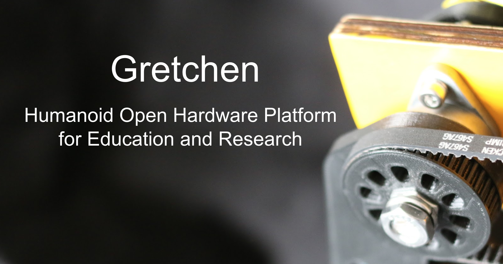
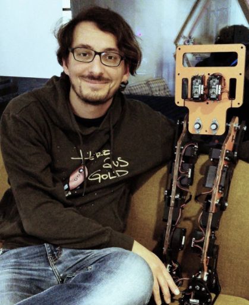
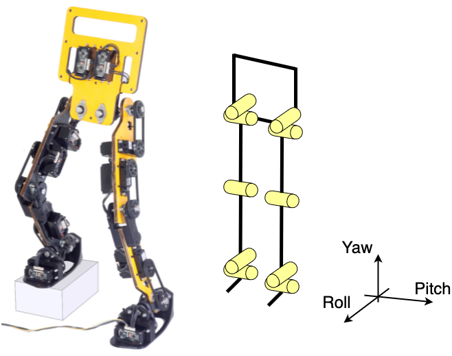
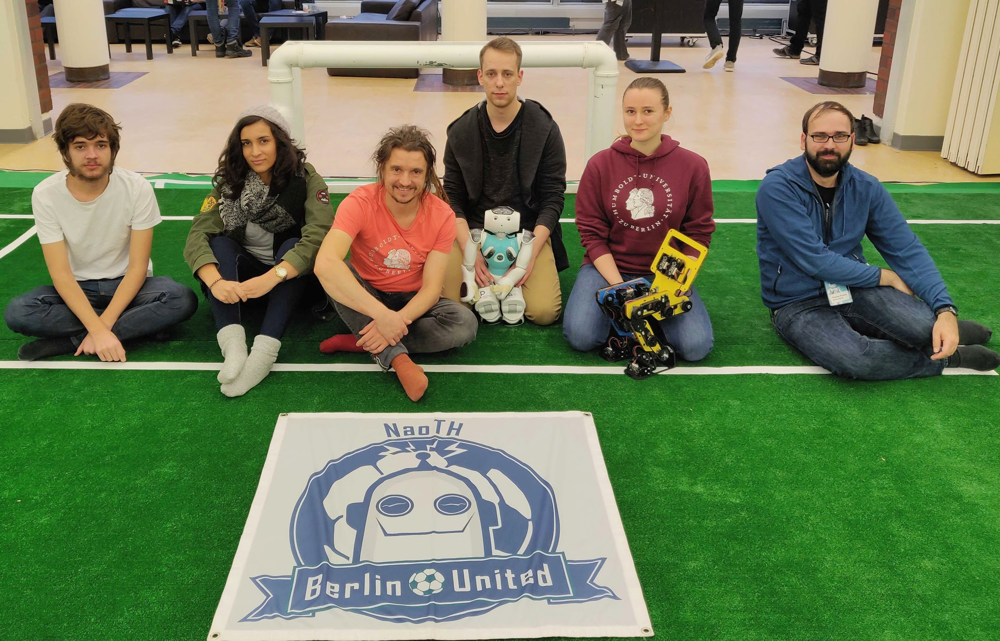
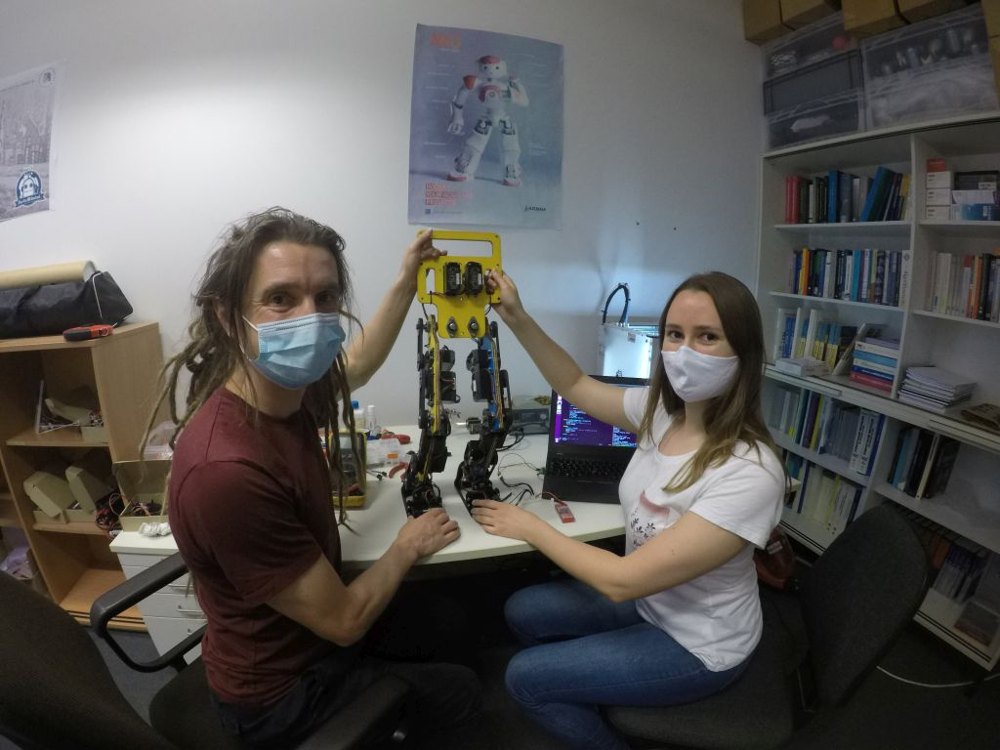

# Introduction

<figure>
  
</figure>

## Welcome 

Research on embodied artificial intelligence (Embodied AI) based on biological systems is becoming increasingly significant. Biological systems are inherently decentralized, with individual parts of the body having their own intelligence. Intelligent behavior only arises from the interaction of individual components and their interaction with the environment. Hence, the body is an indispensable part of any research of intelligence. Humanoid robots are particularly interesting, however they are still difficult to access, are associated with high costs and often have to be developed by scientists themselves, therby restricting the group of users. In this project we are developing a humanoid robot “Gretchen” for research and teaching. Our focus lies on the openness of hardware and software, as well as on the accessibility of the robot for non-specialist researchers. A prototype of the Gretchen robot is already being used in seminars at the Adaptive Systems Group at Humboldt University.

The Gretchen robot is a versatile platform for training, as its modular structure enables work and experimentation through hardware design, actuators, 3D printed components, firmware, power supply, communication bus, software libraries or the API.

This documentation gives an overview over the current state of the hardware and the software base of **the Gretchen robot**, as well as brings together all further contributions from various projects and seminars.

## The Gretchen Robot

**The Gretchen robot** was designed and developed by Matthias Kubisch in collaboration with the AI Brain Company in 2018. One of the prototypes of the robot is currently used for academic research and education in the lab of the Adaptive Systems Group in the Computer Science department of the Humboldt University. **The Gretchen robot** is a versatile platform for education, as its modular design allows working and experimenting by its hardware design, actuators, 3D-printed components, firmware, power supply, communication bus, software libraries or the API.

<figure>
  
  <figcaption>
  	Matthias Kubisch and the Gretchen robot
</figcaption>
</figure>

**The Gretchen robot** is 74 cm high, weighs approximately 5 kg, and has 10 degrees of freedom
(DoFs), 5 of which are in each leg: 2 in the hip (roll and pitch), 1 in the knee (pitch), and 2 in the ankle (roll and pitch). The robot resembles the lower part of the human body, by incorporating feet, legs and lower torso as shown in the picture below.

<figure>
  
  <figcaption>
  	Kinematic structure of the Gretchen robot
</figcaption>
</figure>

The body parts are made from low-cost materials such as wood and 3D-printed components, the CAD files of which can be found on GitHub <https://github.com/suprememachines>.

The robot cannot be purchased, however, it can be manufactured from 3D-printed as
well as commercially available materials and electronic components. The Sensorimotor
boards are the only components that require custom manufacturing and they can be
ordered by using the provided schematic circuits. Gretchen’s overall manufacturing
costs lie at roughly 1,400AC.

## Team

The research group **NaoTH** is part of the research lab for Adaptive
Systems at Humboldt-Universität zu Berlin headed by Prof. Verena Hafner.
At the current state the core team consists of about 12 students of
Bachelor, Master/Diploma, and PhD levels. Besides the direct
participation at the RoboCup competitions NaoTH is involved in teaching
at the university, public engagement and building of the RoboCup
community.

<figure>
  
  <figcaption>
  	The NaoTH Team at Rohow, where the Gretchen robot was introduced to the RoboCup community for the first time.
</figcaption>
</figure>

**NaoTH** was founded at the end of 2007 at the AI research lab headed by
Prof. Hans-Dieter Burkhard. As a direct successor of the **Aibo Team
Humboldt** which was active in the Four Legged League of the RoboCup as a
part of the **GermanTeam** until 2008. GermanTeam won the world
championship three times during its existence.

**NaoTH** participated yearly at the RoboCup competitions since the first
SPL competition in 2008 in Suzhou. The most recent achievements include
3rd place in the Outdoor Competition at the RoboCup world championship
in 2016 and 2nd place in the Mixed Team Competition as part of the team
**DoBerMan** at the RoboCup 2017.

<figure>
  
  <figcaption>
  	Heinrich Mellmann and Anastasia Prisacaru working on the Gretchen robot.
</figcaption>
</figure>

**The Gretchen project** is a great opportunity for the **NaoTH** team to apply the acquired knowledge and expertise in programming humanoid robots from the past two decades of competing in RoboCup. **The Gretchen robot** provides a great platform for experiments and research, since its hardware is completely open source, in contrast to the NAO robots. Our aspiration is to develop **the Gretchen robot** to the point when it is qualified to join the humanoid legue of the RoboCup Competition. 